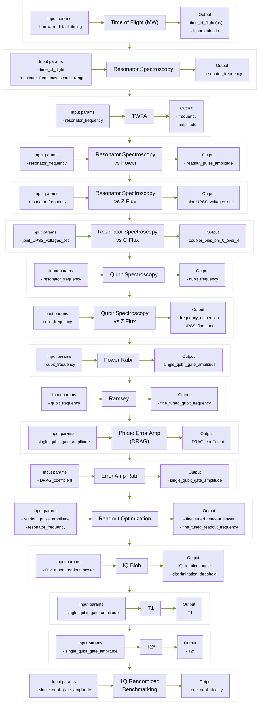

# Superconducting Qubit Calibration Flow

```mermaid
%%{init: {'theme':'base', 'themeVariables': { 'primaryColor':'#e6e6fa','primaryTextColor':'#000','primaryBorderColor':'#9370db','lineColor':'#6b8e23','secondaryColor':'#fffacd','tertiaryColor':'#fff'}, 'flowchart': {'nodeSpacing': 5, 'rankSpacing': 20, 'padding': 10}}}%%
flowchart TB
    subgraph Exp1[" "]
        direction LR
        I1["<span style='font-size:12px'>Input params<br/>- hardware default timing</span>"] --> E1["Time of Flight (MW)"]
        E1 --> O1["<span style='font-size:12px'>Output<br/>- time_of_flight (ns)<br/>- input_gain_db</span>"]
    end
    
    subgraph Exp2[" "]
        direction LR
        I2["<span style='font-size:12px'>Input params<br/>- time_of_flight<br/>- resonator_frequency_search_range</span>"] --> E2["Resonator Spectroscopy"]
        E2 --> O2["<span style='font-size:12px'>Output<br/>- resonator_frequency</span>"]
    end
    
    subgraph Exp3[" "]
        direction LR
        I3["<span style='font-size:12px'>Input params<br/>- resonator_frequency</span>"] --> E3["TWPA"]
        E3 --> O3["<span style='font-size:12px'>Output<br/>- frequency<br/>- amplitude</span>"]
    end
    
    subgraph Exp4[" "]
        direction LR
        I4["<span style='font-size:12px'>Input params<br/>- resonator_frequency</span>"] --> E4["Resonator Spectroscopy<br/>vs Power"]
        E4 --> O4["<span style='font-size:12px'>Output<br/>- readout_pulse_amplitude</span>"]
    end
    
    subgraph Exp5[" "]
        direction LR
        I5["<span style='font-size:12px'>Input params<br/>- resonator_frequency</span>"] --> E5["Resonator Spectroscopy<br/>vs Z Flux"]
        E5 --> O5["<span style='font-size:12px'>Output<br/>- joint_UPSS_voltages_set</span>"]
    end
    
    subgraph Exp6[" "]
        direction LR
        I6["<span style='font-size:12px'>Input params<br/>- joint_UPSS_voltages_set</span>"] --> E6["Resonator Spectroscopy<br/>vs C Flux"]
        E6 --> O6["<span style='font-size:12px'>Output<br/>- coupler_bias_phi_0_over_4</span>"]
    end
    
    subgraph Exp7[" "]
        direction LR
        I7["<span style='font-size:12px'>Input params<br/>- resonator_frequency</span>"] --> E7["Qubit Spectroscopy"]
        E7 --> O7["<span style='font-size:12px'>Output<br/>- qubit_frequency</span>"]
    end
    
    subgraph Exp8[" "]
        direction LR
        I8["<span style='font-size:12px'>Input params<br/>- qubit_frequency</span>"] --> E8["Qubit Spectroscopy<br/>vs Z Flux"]
        E8 --> O8["<span style='font-size:12px'>Output<br/>- frequency_dispersion<br/>- UPSS_fine_tune</span>"]
    end
    
    subgraph Exp9[" "]
        direction LR
        I9["<span style='font-size:12px'>Input params<br/>- qubit_frequency</span>"] --> E9["Power Rabi"]
        E9 --> O9["<span style='font-size:12px'>Output<br/>- single_qubit_gate_amplitude</span>"]
    end
    
    subgraph Exp10[" "]
        direction LR
        I10["<span style='font-size:12px'>Input params<br/>- qubit_frequency</span>"] --> E10["Ramsey"]
        E10 --> O10["<span style='font-size:12px'>Output<br/>- fine_tuned_qubit_frequency</span>"]
    end
    
    subgraph Exp11[" "]
        direction LR
        I11["<span style='font-size:12px'>Input params<br/>- single_qubit_gate_amplitude</span>"] --> E11["Phase Error Amp<br/>(DRAG)"]
        E11 --> O11["<span style='font-size:12px'>Output<br/>- DRAG_coefficient</span>"]
    end
    
    subgraph Exp12[" "]
        direction LR
        I12["<span style='font-size:12px'>Input params<br/>- DRAG_coefficient</span>"] --> E12["Error Amp Rabi"]
        E12 --> O12["<span style='font-size:12px'>Output<br/>- single_qubit_gate_amplitude</span>"]
    end
    
    subgraph Exp13[" "]
        direction LR
        I13["<span style='font-size:12px'>Input params<br/>- readout_pulse_amplitude<br/>- resonator_frequency</span>"] --> E13["Readout Optimization"]
        E13 --> O13["<span style='font-size:12px'>Output<br/>- fine_tuned_readout_power<br/>- fine_tuned_readout_frequency</span>"]
    end
    
    subgraph Exp14[" "]
        direction LR
        I14["<span style='font-size:12px'>Input params<br/>- fine_tuned_readout_power</span>"] --> E14["IQ Blob"]
        E14 --> O14["<span style='font-size:12px'>Output<br/>- IQ_rotation_angle<br/>- discrimination_threshold</span>"]
    end
    
    subgraph Exp15[" "]
        direction LR
        I15["<span style='font-size:12px'>Input params<br/>- single_qubit_gate_amplitude</span>"] --> E15["T1"]
        E15 --> O15["<span style='font-size:12px'>Output<br/>- T1</span>"]
    end
    
    subgraph Exp16[" "]
        direction LR
        I16["<span style='font-size:12px'>Input params<br/>- single_qubit_gate_amplitude</span>"] --> E16["T2*"]
        E16 --> O16["<span style='font-size:12px'>Output<br/>- T2*</span>"]
    end
    
    subgraph Exp17[" "]
        direction LR
        I17["<span style='font-size:12px'>Input params<br/>- single_qubit_gate_amplitude</span>"] --> E17["1Q Randomized<br/>Benchmarking"]
        E17 --> O17["<span style='font-size:12px'>Output<br/>- one_qubit_fidelity</span>"]
    end
    
    Exp1 --> Exp2
    Exp2 --> Exp3
    Exp3 --> Exp4
    Exp4 --> Exp5
    Exp5 --> Exp6
    Exp6 --> Exp7
    Exp7 --> Exp8
    Exp8 --> Exp9
    Exp9 --> Exp10
    Exp10 --> Exp11
    Exp11 --> Exp12
    Exp12 --> Exp13
    Exp13 --> Exp14
    Exp14 --> Exp15
    Exp15 --> Exp16
    Exp16 --> Exp17
```
