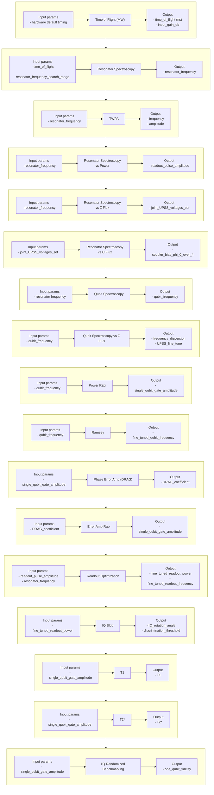

# Superconducting Qubit Calibration Flow

```mermaid
flowchart TB
    subgraph Exp1[" "]
        direction LR
        I1["Input params<br/>- hardware default timing"] --> E1["Time of Flight (MW)"]
        E1 --> O1["Output<br/>- time_of_flight (ns)<br/>- input_gain_db"]
    end
    
    subgraph Exp2[" "]
        direction LR
        I2["Input params<br/>- time_of_flight<br/>- resonator_frequency_search_range"] --> E2["Resonator Spectroscopy"]
        E2 --> O2["Output<br/>- resonator_frequency"]
    end
    
    subgraph Exp3[" "]
        direction LR
        I3["Input params<br/>- resonator_frequency"] --> E3["TWPA"]
        E3 --> O3["Output<br/>- frequency<br/>- amplitude"]
    end
    
    subgraph Exp4[" "]
        direction LR
        I4["Input params<br/>- resonator_frequency"] --> E4["Resonator Spectroscopy<br/>vs Power"]
        E4 --> O4["Output<br/>- readout_pulse_amplitude"]
    end
    
    subgraph Exp5[" "]
        direction LR
        I5["Input params<br/>- resonator_frequency"] --> E5["Resonator Spectroscopy<br/>vs Z Flux"]
        E5 --> O5["Output<br/>- joint_UPSS_voltages_set"]
    end
    
    subgraph Exp6[" "]
        direction LR
        I6["Input params<br/>- joint_UPSS_voltages_set"] --> E6["Resonator Spectroscopy<br/>vs C Flux"]
        E6 --> O6["Output<br/>- coupler_bias_phi_0_over_4"]
    end
    
    subgraph Exp7[" "]
        direction LR
        I7["Input params<br/>- resonator frequency"] --> E7["Qubit Spectroscopy"]
        E7 --> O7["Output<br/>- qubit_frequency"]
    end
    
    subgraph Exp8[" "]
        direction LR
        I8["Input params<br/>- qubit_frequency"] --> E8["Qubit Spectroscopy vs Z Flux"]
        E8 --> O8["Output<br/>- frequency_dispersion<br/>- UPSS_fine_tune"]
    end
    
    subgraph Exp9[" "]
        direction LR
        I9["Input params<br/>- qubit_frequency"] --> E9["Power Rabi"]
        E9 --> O9["Output<br/>- single_qubit_gate_amplitude"]
    end
    
    subgraph Exp10[" "]
        direction LR
        I10["Input params<br/>- qubit_frequency"] --> E10["Ramsey"]
        E10 --> O10["Output<br/>- fine_tuned_qubit_frequency"]
    end
    
    subgraph Exp11[" "]
        direction LR
        I11["Input params<br/>- single_qubit_gate_amplitude"] --> E11["Phase Error Amp (DRAG)"]
        E11 --> O11["Output<br/>- DRAG_coefficient"]
    end
    
    subgraph Exp12[" "]
        direction LR
        I12["Input params<br/>- DRAG_coefficient"] --> E12["Error Amp Rabi"]
        E12 --> O12["Output<br/>- single_qubit_gate_amplitude"]
    end
    
    subgraph Exp13[" "]
        direction LR
        I13["Input params<br/>- readout_pulse_amplitude<br/>- resonator_frequency"] --> E13["Readout Optimization"]
        E13 --> O13["Output<br/>- fine_tuned_readout_power<br/>- fine_tuned_readout_frequency"]
    end
    
    subgraph Exp14[" "]
        direction LR
        I14["Input params<br/>- fine_tuned_readout_power"] --> E14["IQ Blob"]
        E14 --> O14["Output<br/>- IQ_rotation_angle<br/>- discrimination_threshold"]
    end
    
    subgraph Exp15[" "]
        direction LR
        I15["Input params<br/>- single_qubit_gate_amplitude"] --> E15["T1"]
        E15 --> O15["Output<br/>- T1"]
    end
    
    subgraph Exp16[" "]
        direction LR
        I16["Input params<br/>- single_qubit_gate_amplitude"] --> E16["T2*"]
        E16 --> O16["Output<br/>- T2*"]
    end
    
    subgraph Exp17[" "]
        direction LR
        I17["Input params<br/>- single_qubit_gate_amplitude"] --> E17["1Q Randomized Benchmarking"]
        E17 --> O17["Output<br/>- one_qubit_fidelity"]
    end
    
    Exp1 --> Exp2
    Exp2 --> Exp3
    Exp3 --> Exp4
    Exp4 --> Exp5
    Exp5 --> Exp6
    Exp6 --> Exp7
    Exp7 --> Exp8
    Exp8 --> Exp9
    Exp9 --> Exp10
    Exp10 --> Exp11
    Exp11 --> Exp12
    Exp12 --> Exp13
    Exp13 --> Exp14
    Exp14 --> Exp15
    Exp15 --> Exp16
    Exp16 --> Exp17
```
